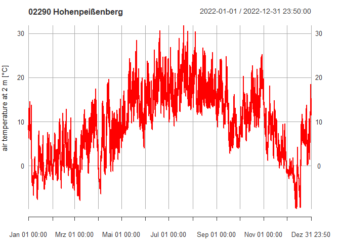

<!-- README.md is generated from README.Rmd. Please edit that file -->

# HPBdata

<!-- badges: start -->

[](https://github.com/dimfalk/HPBdata/actions/workflows/R-CMD-check.yaml)
[](https://app.codecov.io/gh/dimfalk/HPBdata)
<!-- badges: end -->

HPBdata aims to provide access to historical meteorological measurements
at various temporal resolutions (1 min, 10 min, 1 day) obtained at
‘Hohenpeißenberg’ site (Bavaria, Germany). Data was acquired from the
[Climate Data
Center](https://opendata.dwd.de/climate_environment/CDC/observations_germany/climate)
hosted by the German Weather Service and has been coverted to `{xts}`
objects for subsequent applications in need of representative
meteorological measurements.

Since I found myself in the need of a meteorological measurement sample
dataset for climatological evaluations, meteorological calculations,
extreme value statistics, etc quite often, I decided to assemble needed
data in order to simplify package development in the future.

## Installation

You can install the development version of HPBdata with:

``` r
# install.packages("devtools")
devtools::install_github("dimfalk/HPBdata")
```

and load the package via

``` r
library(HPBdata)
#> 0.1.6
```

## Getting started

There is not really much to say about the use. HPBdata is a data-only
package without any functions provided consisting of three objects:

`obs_1min`, `obs_10min` and `obs_1d`.

These are named lists of different length containing xts objects of
different length at specified interval width for various meteorological
parameters.

For details, it is strongly encouraged to study the dataset
documentation provided, e.g. `?obs_10min`, and the official dataset
description linked there.

``` r
# inspect superordinate list
class(obs_10min)
#> [1] "list"

length(obs_10min)
#> [1] 9

names(obs_10min)
#> [1] "PP_10"  "TT_10"  "TM5_10" "RF_10"  "FF_10"  "DD_10"  "GS_10"  "SD_10" 
#> [9] "RWS_10"

# inspect xts objects contained
class(obs_10min[["TT_10"]])
#> [1] "xts" "zoo"

length(obs_10min[["TT_10"]])
#> [1] 1581036
```

As a little remark worth noting, the xts objects contained are provided
with some additional metadata appended in form of attributes based on a
data model implemented in `{timeseriesIO}` to ensure I/O compatibility:

``` r
attributes(obs_10min[["TT_10"]])[5:22]
#> $MEAS_RESOLUTION
#> [1] 10
#> 
#> $STAT_ID
#> [1] "02290"
#> 
#> $STAT_NAME
#> [1] "Hohenpeißenberg"
#> 
#> $X
#> [1] 11.0108
#> 
#> $Y
#> [1] 47.8009
#> 
#> $Z
#> [1] 977
#> 
#> $CRS_EPSG
#> [1] "4326"
#> 
#> $HRS_EPSG
#> [1] NA
#> 
#> $TZONE
#> [1] "UTC"
#> 
#> $PARAMETER
#> [1] "Lufttemperatur"
#> 
#> $TS_START
#> [1] "1993-12-09 13:50:00 UTC"
#> 
#> $TS_END
#> [1] "2023-12-31 23:40:00 UTC"
#> 
#> $TS_DEFLATE
#> [1] FALSE
#> 
#> $TS_TYPE
#> [1] "measurement"
#> 
#> $MEAS_INTERVALTYPE
#> [1] TRUE
#> 
#> $MEAS_BLOCKING
#> [1] "left"
#> 
#> $MEAS_UNIT
#> [1] "°C"
#> 
#> $MEAS_STATEMENT
#> [1] "mean"
```

Other than that, you can now just leverage all the sweet xts
functionality:

``` r
library(xts)
#> Lade nötiges Paket: zoo
#> 
#> Attache Paket: 'zoo'
#> Die folgenden Objekte sind maskiert von 'package:base':
#> 
#>     as.Date, as.Date.numeric

# subsetting
x <- obs_10min[["TT_10"]]["2022"]
x
#>                     TT_10
#> 2022-01-01 00:00:00   9.2
#> 2022-01-01 00:10:00   9.2
#> 2022-01-01 00:20:00   9.1
#> 2022-01-01 00:30:00   9.0
#> 2022-01-01 00:40:00   8.8
#> 2022-01-01 00:50:00   8.7
#> 2022-01-01 01:00:00   8.6
#> 2022-01-01 01:10:00   8.5
#> 2022-01-01 01:20:00   8.5
#> 2022-01-01 01:30:00   8.3
#>                 ...      
#> 2022-12-31 22:20:00  12.2
#> 2022-12-31 22:30:00  13.0
#> 2022-12-31 22:40:00  12.9
#> 2022-12-31 22:50:00  13.4
#> 2022-12-31 23:00:00  14.2
#> 2022-12-31 23:10:00  15.3
#> 2022-12-31 23:20:00  14.9
#> 2022-12-31 23:30:00  14.7
#> 2022-12-31 23:40:00  14.1
#> 2022-12-31 23:50:00  11.4

# aggregating
xts::apply.monthly(x, "mean", na.rm = TRUE) |> round(1)
#>                     TT_10
#> 2022-01-31 23:50:00   0.5
#> 2022-02-28 23:50:00   1.8
#> 2022-03-31 23:50:00   4.8
#> 2022-04-30 23:50:00   5.7
#> 2022-05-31 23:50:00  13.2
#> 2022-06-30 23:50:00  17.2
#> 2022-07-31 23:50:00  18.2
#> 2022-08-31 23:50:00  17.8
#> 2022-09-30 23:50:00  11.4
#> 2022-10-31 23:50:00  13.4
#> 2022-11-30 23:50:00   5.9
#> 2022-12-31 23:50:00   1.3

# plotting
plot(x, ylab = "air temperature at 2 m [°C]", col = "red", main = "02290 Hohenpeißenberg")
```


